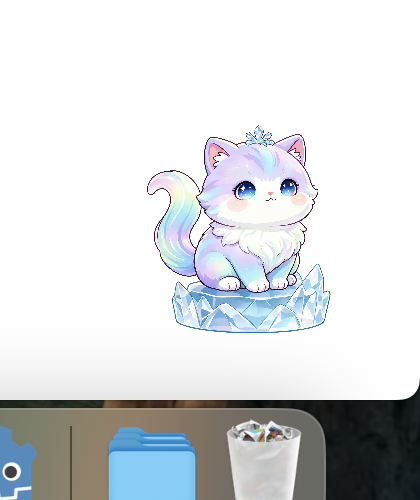

# 启动日桌宠工作系统

一个仅面向当前苹果芯片电脑的本地智能工作系统。三维绿色绒毛桌宠是常驻入口，轻面板负责快速输入，完整工作台负责查看计划、依赖、权限、进度和成果。



当前桌宠窗口为 264 × 231 像素。毛发由 48 层密集短绒、1.5 万根独立细毛和参考图提炼的真实绒毛材质共同组成，内部使用 528 × 462 双倍尺寸渲染。

成品只保留苹果芯片程序，不包含英特尔版本；同时包含玻璃眼睛、呼吸、眨眼、视线跟随和拖拽反馈。

## 启动

完整系统开发启动：

```bash
npm install
npm start
```

只启动独立桌宠时，可以双击 `build/毛球桌宠.app`。

开发时可双击 `scripts/run.command`，或在项目目录运行：

```bash
/Applications/Godot.app/Contents/MacOS/Godot --path .
```

需要重新生成成品时，双击 `scripts/export.command`。

## 操作

- 单击桌宠打开轻面板；拖拽不会误触打开。
- 按住鼠标左键拖动桌宠。
- 移动鼠标时，桌宠视线会跟随光标。
- 轻面板支持文字输入，语音入口标记为后续开放。
- 联动模式下右键桌宠会关闭桌宠和工作台；独立模式下只关闭桌宠。

## Codex 执行代理

桌宠是工作入口，Codex 是受控执行能力。完整流程为：

1. 在轻面板输入目标，系统整理目标、节点、依赖和最晚开始时间。
2. 选择一个本机工作目录；代理只能在这个目录内执行。
3. 生成执行计划，检查模型、目录、工具、网络和风险后手动确认。
4. 创建或覆盖文件等操作会暂停并请求批准；删除、对外发送、发布、支付和权限修改直接拒绝。
5. 代理完成后，系统验证成果路径、文件类型、内容和摘要值。
6. 用户查看并接受成果、填写实际耗时后，工作节点才会完成。

项目固定安装 `@openai/codex@0.150.1`，启动时按以下顺序寻找执行程序：

1. 环境变量 `STARTDAY_CODEX_PATH` 指定的程序。
2. 项目内安装的程序。
3. 系统命令路径中的程序。

启动后，工作台会显示账号、模型和额度状态。未登录时点击“登录”，在浏览器完成账号登录后返回工作台刷新状态。程序不会保存接口密钥、访问令牌或登录请求头。

模型优先选择 `gpt-5.6-terra`；如果账号没有该模型，就使用代理返回的默认模型。因此通常不需要手工配置模型，也不需要单独填写接口密钥。

公开网页调研默认关闭。只有在完整工作台勾选“允许本次计划访问公开网页”，本次执行才会获得公开网络读取权限；内网地址和本机地址始终拒绝。

如需使用另一个兼容版本的本机程序：

```bash
STARTDAY_CODEX_PATH=/绝对路径/codex npm start
```

## 自动检查

```bash
/Applications/Godot.app/Contents/MacOS/Godot --headless --editor --path . --quit
/Applications/Godot.app/Contents/MacOS/Godot --headless --path . --script res://tests/run_tests.gd
./tests/test_export_app.command
```

桌面端业务、权限和代理协议检查：

```bash
npm test
npm run typecheck
npm run build:desktop
```

真实账号沙箱验收会调用一次模型，只能在自动创建的临时目录内生成一个文本成果：

```bash
STARTDAY_REAL_CODEX_TEST=1 node --test --import tsx tests/integration/codex-real.test.ts
```

## 业务核心演示

下面的命令会用固定数据演示“创建季度复盘计划、自动倒排、变更协作方、重新计算当前行动”的完整闭环：

```bash
npm run demo:core
```
