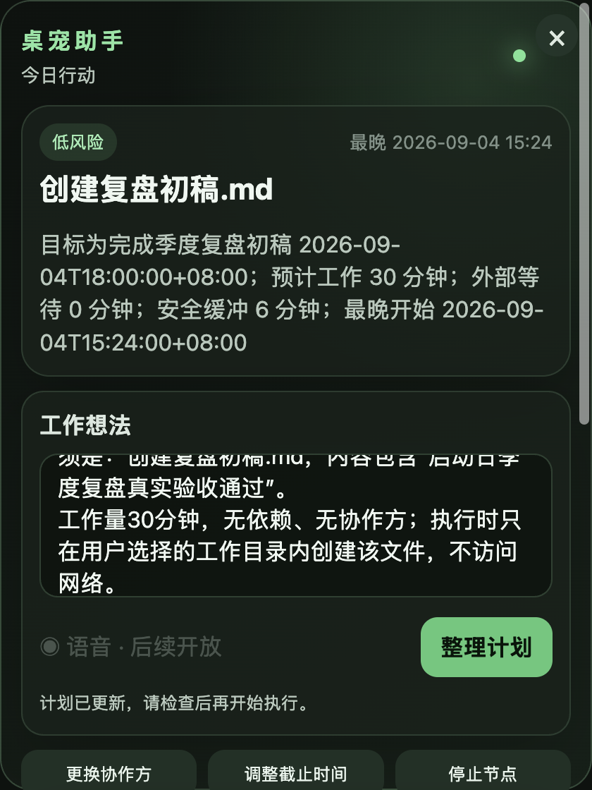

# 启动日桌宠工作系统

启动日是仅面向当前苹果芯片电脑的本地智能工作系统。三维绿色绒毛桌宠是常驻入口，轻面板负责快速输入和当前行动，完整工作台负责计划、依赖、权限、进度、成果与历史记录。




## 直接使用

生成安装包：

```bash
npm install
npm run package
```

生成后双击 `release/启动日.app`。一次启动会同时打开桌面主程序和桌宠，不需要分别运行。安装包使用本机临时签名；如果系统首次拦截，可在访达中右键应用并选择“打开”。

关闭轻面板右上角的“×”只会隐藏面板，不会退出应用；再次单击桌宠即可打开。右键桌宠才会退出桌宠和工作台。

## 第一次使用

1. 单击桌宠，在轻面板输入一件真实工作，最好写清截止时间、协作方和等待关系。
2. 系统从首个案例建立基础工作习惯，显示工作时段、每日容量和安全缓冲；点击“确认工作习惯”后才生成行动建议。
3. 如果执行代理显示“需要登录”，点击登录按钮，在浏览器完成账号登录，再回到工作台刷新状态。
4. 点击“选择目录”，只授权本次任务需要使用的本机目录。
5. 点击“生成执行计划”，检查模型、目录、工具、网络和风险范围，再点击“确认并开始”。
6. 创建或修改文件时，界面会显示具体影响；按需选择“批准一次”或“拒绝”。
7. 成果通过路径和内容验证后，先查看文件，再点击“接受成果”并记录实际耗时。只有此时工作节点才会完成。

当前首版只提供文字输入。语音入口已经保留，但语音识别和语音对话按计划留到后续版本。

## 执行代理与模型

桌宠负责入口和状态，启动日核心负责工作关系与排期，Codex 负责在授权范围内生成实际成果。三者职责分离，模型不能绕过启动日权限直接控制电脑。

安装包已内置固定版本的执行代理。模型优先选择 `gpt-5.6-terra`；账号没有该模型时使用服务端默认模型，因此通常不需要手工配置模型，也不需要填写接口密钥。程序不会把访问令牌、登录请求头或用户数据库打入安装包。

开发模式按以下顺序寻找执行程序：

1. `STARTDAY_CODEX_PATH` 指定的绝对路径。
2. 项目内安装的程序。
3. 系统命令路径中的程序。

如需指定另一个兼容程序：

```bash
STARTDAY_CODEX_PATH=/绝对路径/codex npm start
```

## 权限边界

第一版支持：

- 读取用户明确选择的工作目录。
- 在授权目录创建成果。
- 经单次确认后修改或移动已有文件。
- 运行已声明的只读测试。
- 用户主动勾选后读取公开网页。

第一版直接拒绝：

- 删除文件和删除命令。
- 工作目录外写入以及通过符号链接越界。
- 未确认的覆盖、移动和依赖安装。
- 自动发送消息、对外发布、支付和权限修改。
- 本机、局域网、链路本地和其他非公开网络地址。

公开网页调研默认关闭。只有在完整工作台勾选“允许本次计划访问公开网页”时，本次任务才能读取公开网页。

## 变更、恢复与记录

- 截止时间、里程碑或负责人变化后会重新排期，并记录变化原因。
- 停止上游节点前会列出受影响的下游节点并再次确认。
- 失败和取消会保存真实终态，不会误标为完成。
- 使用同一个应用资料目录重启后，会恢复最近工作计划、执行、审批、成果和历史记录。
- 执行代理或桌宠退出时，主程序会清理关联子进程；桌宠异常退出会在限制次数内自动重启。

## 常见问题

执行代理不可用：先在工作台刷新状态；若显示需要登录，使用产品内登录入口完成浏览器授权。不要在聊天、文档或仓库中粘贴接口密钥。

没有可用模型：确认登录账号有可用模型和额度。系统会自动优先选择平衡模型，无法选择时会显示明确原因。

无法开始执行：依次确认个人工作习惯、选择工作目录、检查账号与模型状态，并确认没有其他进行中的执行。

轻面板不见了：单击桌宠重新打开。右上角“×”只隐藏面板。

成果未完成：成果必须位于授权目录、是非空普通文件并通过验证；失败原因可在完整工作台的执行记录中查看。

## 开发与验收

开发启动：

```bash
npm install
npm start
```

一条命令运行完整审计：

```bash
./scripts/run-all-checks.command
```

该命令包含类型检查、业务与安全测试、桌宠测试、苹果芯片导出、最终安装包、桌面端到端流程、真实代理临时目录验收和截图证据检查。真实验收会调用账号模型，但只允许在自动创建的临时目录内生成成果。

只运行常用检查：

```bash
npm test
npm run typecheck
npm run test:e2e
npm run package
npm run verify:package
```

需求逐项证据见 `docs/verification/2026-08-28-startday-verification.md`。
